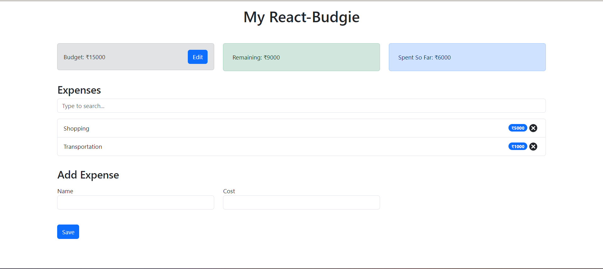

# React-Budgie

React-Budgie is a budget management application built with React. It provides a user-friendly interface to help you track your expenses, manage your budget, and achieve your financial goals.



## Features

- **Budget Overview**: Get a clear budget overview, including the total budget amount, remaining budget, and total expenses.
- **Expense Tracking**: Easily add and remove expenses, with fields for expense name and cost.
- **LocalStorage Integration**: Your expense data is automatically saved to the browser's localStorage, ensuring your data persists after refreshing the page.
- **Responsive Design**: Enjoy a seamless budget management experience across different devices and screen sizes.

## Getting Started

Follow these steps to get started with React-Budgie:

1. Clone the repository:

   ``` shell
   git clone https://github.com/sdivyanshu90/React-Budgie.git
   ```

2. Navigate to the project directory:

   ``` shell
   cd React-Budgie
   ```

3. Install the dependencies:

   ``` shell
   npm install
   ```

4. Start the development server:

   ``` shell
   npm start
   ```

5. Open your browser and visit `http://localhost:3000` to view the app.

## Contributing

Contributions are welcome! Feel free to open an issue or submit a pull request if you have any ideas, suggestions, or improvements. Please ensure that your contributions align with the project's coding conventions and standards.


## ⭐️ Give it a Star

If you find React-Budgie helpful or interesting, please consider giving the repository a star on GitHub. Your support is greatly appreciated and encourages the project's continued development.

👉 [Give React-Budgie a Star](https://github.com/sdivyanshu90/React-Budgie)

---
